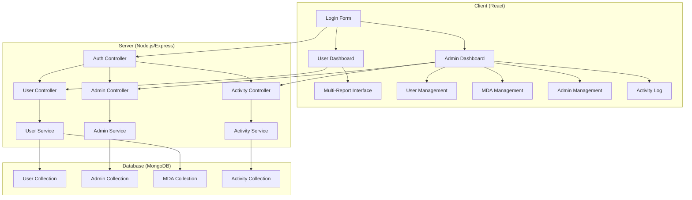
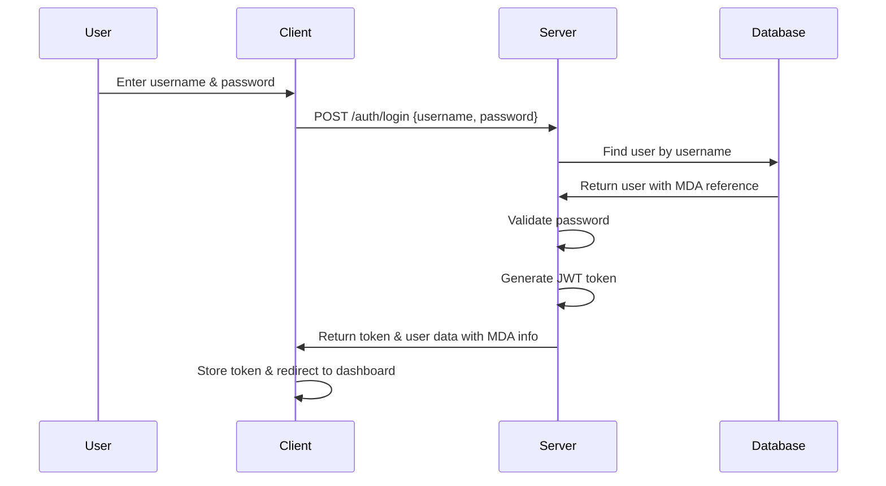

# Design Document

## Overview

This design document outlines the technical architecture and implementation approach for enhancing the MDA reporting system with username-based authentication, multi-report support, hierarchical admin management, and comprehensive activity logging.

## Architecture

### System Architecture Overview

The enhanced system maintains the existing Client-Server architecture with React frontend and Node.js/Express backend, but introduces significant changes to the data models, authentication flow, and admin management capabilities.



### Authentication Architecture

The authentication system is redesigned to use username-based login instead of email-based login with MDA selection.



## Components and Interfaces

### Data Models

#### Enhanced User Model
```javascript
{
  username: String, // New: unique identifier for login
  name: String,
  contactEmail: String, // Renamed from email
  password: String,
  role: String, // "user"
  mdaReference: String, // New: string reference to MDA
  isActive: Boolean,
  lastLogin: Date,
  createdAt: Date,
  updatedAt: Date
}
```

#### Enhanced Admin Model
```javascript
{
  name: String,
  email: String, // Admins still use email for login
  password: String,
  role: String, // "superadmin" or "admin"
  canBeDeleted: Boolean, // New: prevents super admin deletion
  createdBy: ObjectId, // New: reference to creating admin
  isActive: Boolean,
  lastLogin: Date,
  createdAt: Date,
  updatedAt: Date
}
```

#### Enhanced MDA Model
```javascript
{
  name: String,
  reports: [{ // New: array of report objects
    title: String,
    url: String,
    isActive: Boolean
  }],
  isActive: Boolean,
  createdAt: Date,
  updatedAt: Date
}
```

#### New Activity Model
```javascript
{
  adminId: ObjectId,
  adminName: String,
  action: String, // CREATE, UPDATE, DELETE, LOGIN, LOGOUT
  resourceType: String, // USER, MDA, ADMIN
  resourceId: String,
  resourceName: String,
  details: Object, // Additional context
  ipAddress: String,
  userAgent: String,
  timestamp: Date
}
```

### API Endpoints

#### Authentication Endpoints
- `POST /auth/login` - Username-based user login
- `POST /auth/admin/login` - Email-based admin login
- `POST /auth/logout` - User/admin logout

#### User Management Endpoints
- `GET /admin/users` - Get all users
- `POST /admin/users` - Create new user
- `PUT /admin/users/:id` - Update user
- `DELETE /admin/users/:id` - Delete user
- `PUT /admin/users/:id/reset-password` - Reset user password

#### Admin Management Endpoints (New)
- `GET /admin/admins` - Get all admins (super admin only)
- `POST /admin/admins` - Create new admin (super admin only)
- `PUT /admin/admins/:id` - Update admin (super admin only)
- `DELETE /admin/admins/:id` - Delete admin (super admin only)

#### MDA Management Endpoints
- `GET /admin/mdas` - Get all MDAs
- `POST /admin/mdas` - Create new MDA
- `PUT /admin/mdas/:id` - Update MDA
- `DELETE /admin/mdas/:id` - Delete MDA

#### Activity Logging Endpoints (New)
- `GET /admin/activities` - Get activity logs (super admin only)
- `GET /admin/activities/export` - Export activity logs (super admin only)

### Frontend Components

#### Authentication Components
- `LoginForm` - Updated for username-based login
- `AdminLoginForm` - Remains email-based for admins

#### Dashboard Components
- `MultiReportInterface` - New component for report selection
- `ReportTabs` - Tab interface for multiple reports
- `ReportViewer` - Enhanced iframe component

#### Admin Management Components (New)
- `AdminManagement` - Admin CRUD interface
- `CreateAdminModal` - Admin creation form
- `UpdateAdminModal` - Admin editing form
- `AdminList` - Display all admins with role indicators

#### Activity Logging Components (New)
- `ActivityLog` - Activity viewing interface
- `ActivityFilters` - Filtering and search controls
- `ActivityExport` - Export functionality

## Data Models

### Database Schema Changes

#### User Collection Migration
```javascript
// Migration script requirements:
// 1. Add username field (derived from MDA name + user identifier)
// 2. Rename email to contactEmail
// 3. Add mdaReference field (string reference to MDA name)
// 4. Remove mdaId ObjectId reference
// 5. Update indexes: remove email index, add username index
```

#### MDA Collection Migration
```javascript
// Migration script requirements:
// 1. Convert single reportUrl to reports array
// 2. Create report object with title and url
// 3. Set default title if not provided
// 4. Maintain backward compatibility during transition
```

#### Admin Collection Migration
```javascript
// Migration script requirements:
// 1. Add canBeDeleted field (false for super admin, true for others)
// 2. Add createdBy field where applicable
// 3. Update role enum to include 'admin' option
```

### Indexing Strategy
- User collection: Index on username (unique), mdaReference, isActive
- Admin collection: Index on email (unique), role, isActive
- MDA collection: Index on name (unique), isActive
- Activity collection: Index on adminId, timestamp, resourceType, action

## Error Handling

### Authentication Errors
- Invalid username/password combinations
- Account deactivation handling
- Session expiration management
- Rate limiting for login attempts

### Authorization Errors
- Role-based access control violations
- Super admin privilege protection
- Resource ownership validation

### Data Validation Errors
- Username uniqueness validation
- Report URL format validation
- Required field validation
- Data type validation

### System Errors
- Database connection failures
- Migration script error handling
- Activity logging failures
- Report loading errors

## Testing Strategy

### Unit Testing
- Model validation testing
- Service layer testing
- Controller endpoint testing
- Utility function testing

### Integration Testing
- Authentication flow testing
- Multi-report functionality testing
- Admin management workflow testing
- Activity logging verification

### End-to-End Testing
- Complete user login and dashboard flow
- Admin management workflows
- Report selection and viewing
- Activity log filtering and export

### Migration Testing
- Database migration script validation
- Data integrity verification
- Rollback procedure testing
- Performance impact assessment

## Security Considerations

### Authentication Security
- Password hashing with bcrypt
- JWT token security and expiration
- Session management and invalidation
- Username enumeration protection

### Authorization Security
- Role-based access control implementation
- Super admin privilege protection
- Resource-level permission checking
- API endpoint protection

### Data Security
- Input validation and sanitization
- SQL injection prevention
- XSS protection for report URLs
- Audit trail integrity

### Activity Logging Security
- Tamper-proof activity logs
- Sensitive data exclusion from logs
- Log retention policies
- Access control for activity data

## Performance Considerations

### Database Performance
- Proper indexing for new query patterns
- Efficient pagination for activity logs
- Query optimization for multi-report loading
- Connection pooling and caching

### Frontend Performance
- Lazy loading for report iframes
- Efficient state management for multi-reports
- Optimized re-rendering for activity logs
- Caching strategies for MDA data

### Migration Performance
- Batch processing for large data migrations
- Minimal downtime migration strategies
- Progress tracking and rollback capabilities
- Performance monitoring during migration

## Deployment Strategy

### Migration Phases
1. **Phase 1**: Backend model updates and new endpoints
2. **Phase 2**: Database migration scripts execution
3. **Phase 3**: Frontend component updates and testing
4. **Phase 4**: Production deployment and monitoring

### Rollback Plan
- Database backup before migration
- Rollback scripts for each migration step
- Feature flags for gradual rollout
- Monitoring and alerting for issues

### Monitoring and Alerting
- Authentication success/failure rates
- Activity logging performance
- Report loading times
- System resource utilization